# NBA - JDBC

## Consideraciones previas


La ruta de conexion a la base de datos se puede cambiar en la clase conexion a la ip del servidor que se tenga y el usuario que se tenga

```java
DriverManager.getConnection("jdbc:mysql://<IP>:<PUERTO>/nba","<USUARIO>","<CONTRASEÑA>");
```
El jar se encuentra en out/artifacts/Practica6_JDBC_jar/[Practica6-JDBC.jar](out%2Fartifacts%2FPractica6_JDBC_jar%2FPractica6-JDBC.jar)

`WARNING ⚠️`

Si el proyecto no compila y pone que no se encuentran las clases, se soluciona con un rebuild project


### BD 🔤

La base de datos se puede generar ejecutando integramente el [script base de datos nba.sql](src%2FDataBase%2Fscript%20base%20de%20datos%20nba.sql),
este tiene todo lo necesario para que la aplicacion funcione:

- Creacion de las tablas
- Carga de datos 
- Triggers para la actualizacion de los datos
- Procedures para optimizar los tiempos de la aplicacion

## Ejemplos de funcionamiento
### Llistar tots els jugadors d'un equip.
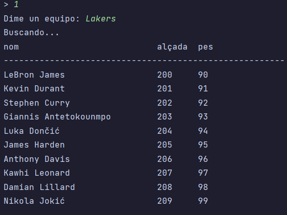

### Calcular la mitjana de punts, rebots, assistències d'un jugador.
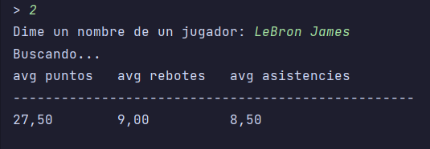

### Llistar tots els partits jugats per un equip amb el seu resultat.
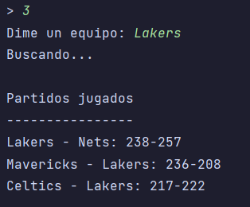

### Inserir un nou jugador a un equip.
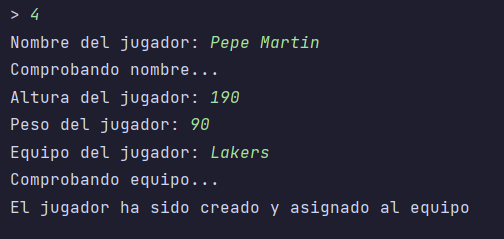

### Si el jugador ja existeix a la base de dades llavors demanem si vol traspassar-lo.
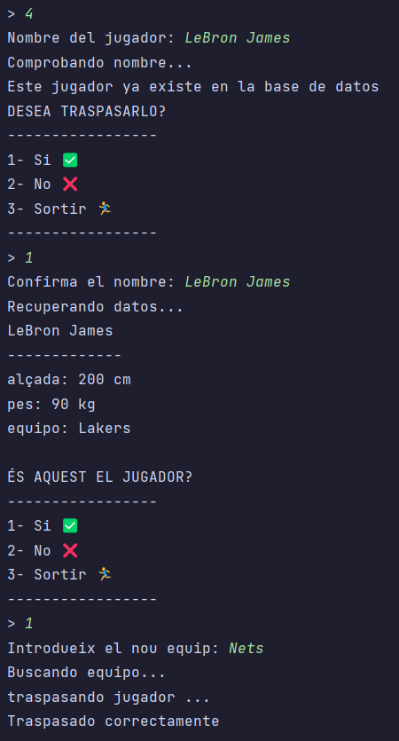

### Traspassar un judador a un altra equip.
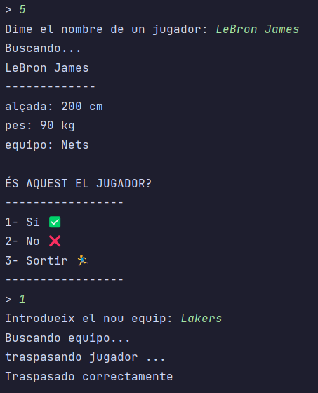

### Actualitzar les dades de jugadors despres del partit.
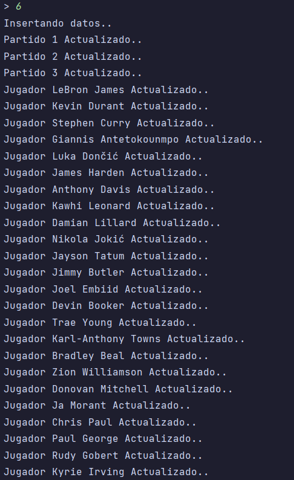

### ...
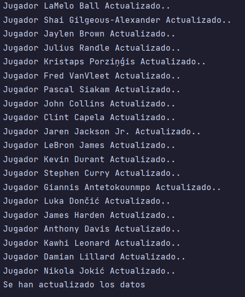

### Modificar les estadístiques d’un jugador a un partit.
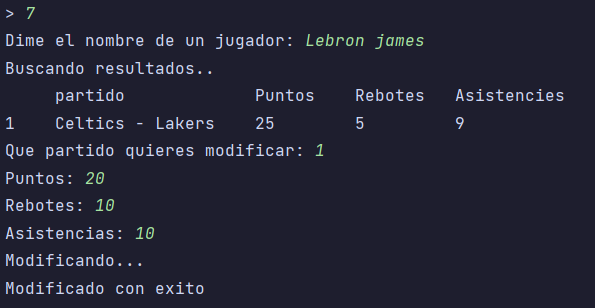

### Retirar un jugador.
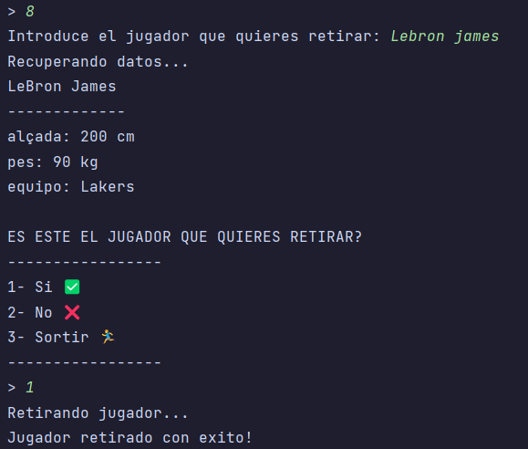

### Canviar nom franquícia d’un equip.
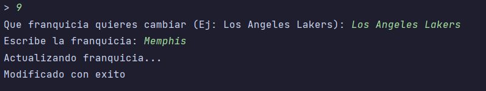

## Descripción

### Controlador ⚙️

#### Conexion 🛜

Hemos decidido hacer una clase conexion con los metodos de conexion y cierre para poder reutilizarlos a lo largo de todo el programa
tenemos uno que cierra obtejos de tipo ```conexion``` y otro de tipo ```statement```

```java
 public static Connection connection()

```
```java
public static void close(Connection con)
public static void close(PreparedStatement smt)
```

### Menu 🟰


La clase menu tiene ```menuPrincipal()``` que se encarga de llamar las funciones en funcion de lo que escoge el usuario

y ```confirmMenu()``` que elabora usando una funcion de la libreria [Libreriascustom.jar](librerias%2FLibreriascustom_jar%2FLibreriascustom.jar)
un menu con un titulo, las opciones que se le pasan y retorna el input del usuario ya verificado.

esta funcion la usamos en varias ocasiones para pedir confirmacion sobre acciones trascendentales en la base de datos como por ejemplo el *retirar un jugador* o *traspasarlo*


### Controlador 🕹️

esta case contiene toda la logica del programa y se encarga de llamar a los metods de la clase model para conectarse a la bd y obtener los datos.

---

```java
listarJugadores()
```

Este metodo, a partir de un input, llama a la funcion ```ListarTodos()``` que se encuentra en ```DaoPlayers``` y trabaja con la lista de objetos de tipo player que retorna.
Mostrando por pantalla usando la clase ```Vista``` y lanzando errores 

---

```java
medianaJugador()
```
Este metodo se sirve de una funcion dentro de ```Player``` para obtener puntos, rebotes y asistencias de un jugador de la tabla ```Player_Stats``` .

Dicha funcion hace dos consultas a la base de datos para obtener sus resultados y luego retorna una lista con ellos que es tratada posteriormente

---

```java
resultadosPartidos()
```
Este metodo lee los resultados de un partido usando una funcion que llama al _procedure_ ```Partidos()``` cuya funcionalidad es retornar un set de resultados en un formato concreto para mejorar el rendimiento del programa, puesto que hay que hacer consultas de dos tablas

```sql
DELIMITER //
CREATE PROCEDURE Partidos(IN pNom VARCHAR(50))
BEGIN
	DECLARE vId_equipo INT;

    SELECT id INTO vId_equipo
		FROM teams
	WHERE nom = pNom;
SELECT CONCAT(te1.nom, ' - ', te2.nom, ': ', ma.punts_visitant, '-', ma.punts_local) AS match_result
	FROM matches ma
	INNER JOIN teams te1 ON ma.id_visitante = te1.id
	INNER JOIN teams te2 ON ma.id_local = te2.id
WHERE ma.id_visitante = vId_equipo OR ma.id_local = vId_equipo;
END //
DELIMITER ;
```
---

```java
insertarJugador()
```
Este metodo se encarga de insertar un nuevo jugador si este no existe ya en la base de datos, en el caso de que exista se pregunta al usuario si se quiere traspasar a otro equipo. 

Para comprobar la existancia de un jugador se usa ```Model.obtenerIdJugador(nom)==-1``` porque la no existencia de un id implica que el jugador no existe y por tanto la funcion **retorna -1**, dando lugar a que el jugador se pueda traspasar.

El parametro _true_ que se le pasa a la funcion de ```Traspas()``` es para imprimir un mensaje adiente si se viene desde esta funcion o si se viene desde el menu principal directamente seleccionando traspaso

---

```java
traspas(traspas_equip)
```

Este metodo se encarga de traspasar un jugador a otro equipo que exista en la base de datos, puesto que si el equipo no existe se informa al usuario y no actualiza la base de datos. 

En todo momento se le pregunta al usuario si el jugador es correcto mostrandole por pantalla los datos usando ```Menu.confirmMenu()``` y el metodo read de la clase DAO correspondiente

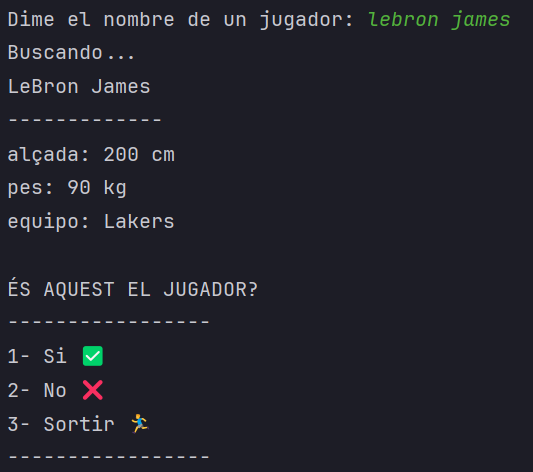

---
```java
actualizarDatos()
```
Este metodo lee los ficheros que se encuentran en [Ficheros](Ficheros) y se encarga de reemplazar los datos que indexados por los que hay en los ficheros. 

En este caso tenemos 3 partidos con datos que se tienen que actualizar:

id partido | puntos visitante | puntos local
```csv
1;240;280
2;230;240
3;220;210
```

y tenemos tambien la actualizacion de los puntos rebotes y asistencias de cada jugador en ese partido concreto

id partido | id jugador | puntos | rebotes | asistencias


```csv
1;1;25;5;9
1;2;29;10;1
...
2;21;25;10;9
2;22;14;11;1
...
3;41;25;9;9
3;42;15;11;1
...
```
---
```java
modificarEstadisticas();
```
Este metodo pregunta por un jugador y muestra un menu con todos los partidos en los que ha participado dicho jugador. 

El usuario puede **seleccionar el partido que quiere modificar**  y cambiar[^1] los valores de puntos, rebotes y asistencias del jugador en ese partido.

`Nota:`

[^1]: modificar los valores en este paso, modifica tambien las medias del jugador (el apartado 2);
Esto debido a un trigger de la BD.

---

````java
retirarJugador()
````
Este metodo se encarga de mover un jugador a una tabla de historicos. Esta accion la hemos interpretado como que se elimina el jugador de la tabla `player` y de la tabla` player_stats`. 

Para conseguir esto, dentro de la base de datos hay un trigger que se encarga de añadir o borrar los jugadores de la tabla player_stats en funcion de las entradas que haya en la tabla de players.

```sql
CREATE TRIGGER player_stats_INS AFTER INSERT ON players FOR EACH ROW
BEGIN
	INSERT INTO player_stats(id_jugador,avg_puntos,avg_rebotes,avg_asistencias)
    VALUES(NEW.id,0,0,0);
END
```


```sql
CREATE TRIGGER player_stats_DEL AFTER DELETE ON players FOR EACH ROW
BEGIN
	DELETE FROM player_stats
    WHERE id_jugador=OLD.id;
END

``` 

La estructura de la tabla de historico es la siguiente:

`id de jugador | puntos | rebotes | asistencias | ultimo equipo`


Siendo datos actualizados al momento de retirarlo, por lo que en este metodo tuvimos que obtener datos de dos tablas:

Para las medias del jugador usamos el metodo `read` de la clase `DaoPlayerStats` y para el obtener el equipo en texto usamos `Model.obtenerNombreEquipo(playerRet.getEquip_actual())` siendo playerRet una instancia de player y el atributo equipo_actual un id.

Luego, con un objeto de la clase `historicPlayers` y el metodo `create` de su clase dao, insertamos la entrada en la tabla correspondiente, asegurandonos de que se elimine la entrada de `player` y `player_stats` una vez creado el registro historico nuevo.

---

```java
 cambiarFranquicia()
```
En la funcion cambiarFranquicia pide al usuario por consola que introduzca la franquicia que desea cambiar. 

Por ejemplo:  
Los Angeles Lakers  

Si la franquicia introducida no se encuentra en la base de datos pasa a mostrar nombres de franquicias similiares a las que ha escrito el usuario.  
Después de haber hecho todas las verificaciones le pide por consola al usuario que introduzca la franquicia a la que desea cambiar. 

Por ejemplo:  
Memphis  

La propia funcion tiene para poner la primera letra en mayuscula por si el usuario ha introducido la franquicia en minusculas.
```java
 String franquiciaNueva = franquicia.substring(0, 1).toUpperCase() + franquicia.substring(1).toLowerCase();
```
Por utlimo actualiza los datos.


---

### Model ✍️

Cada objeto corresponde a una tabla que hay en la base de datos y tiene los atributos correspondientes para poder trabajar con ellos guardando objetos 

#### DAO 🧩

En este package estan todas las clases que tienen implementados los metodos CRUD

En el caso de ```DaoPlayerMatches``` los metodos de create y delete no estan implementados debido a que en la base de datos se crean y se elimina los datos mediante un tigger

Sin embargo en ```DaoHistoricPlayers``` no estan implementados los metodos RUD porque no son necesarios en este programa, pero podrian serlo entonces estan puestos en la clase.

### Vista 🕶️

En esta clase se encuentran todos los metodos de imprimir por pantalla usados en la aplicacion, hay metodos para mostrar arrays personalizados y genericos 
